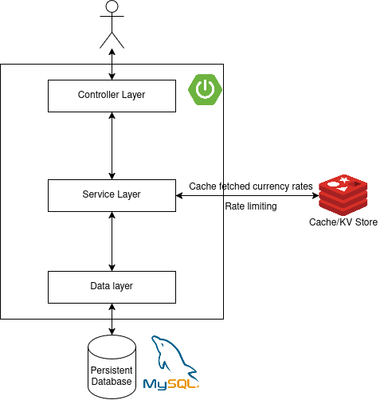

# RHO Challenge - Currency Exchange API

**Currency Exchange API** is a REST API for fetching data regarding currency conversions, with high focus on caching and minimizing costly API calls.

Currency exchange data is extracted from the [`exchangerate`](https://exchangerate.host/) API.

## Table of Contents

- [Installation](#installation)
- [Usage](#usage)
- [Features](#features)
- [Technologies Used](#technologies-used)
- [Architecture](#architecture)
- [Optimizations for minimizing external API calls](#optimizations-for-minimizing-external-api-calls)
- [Testing](#testing)
- [References](#references)

## Prerequisites

In order to run this API, you need to have one of the two following options installed in your machine:
- \[RECOMMENDED\] [`docker`](https://docs.docker.com/engine/install/) (with the [`docker compose plugin`](https://docs.docker.com/compose/install/))
- [`Maven`](https://maven.apache.org/install.html) along with the `Java 17` JDK, using your favorite distribution ([OpenJDK](https://jdk.java.net/archive/)). You also need to have a [`redis-server 6.2.17`](https://github.com/redis/redis/releases/tag/6.2.17) and [`MySQL 8.4`](https://www.mysql.com/) instance running.

## Installation and running the application

1. Clone this repository and enter the project folder

```sh
git clone git@github.com:notjoao1/rho-exchange-rate.git
cd rho-exchange-rate
```

2. Set your environment variables - including the **external API key** for [`exchangerate`](https://exchangerate.host/).


3. Run the application

- \[RECOMMENDED\] With **docker**:
```sh
docker compose up -d
```

- With **maven** (assuming `MySQL` and `Redis` server instances are running at the correct ports - setup your environment variables, check `.env` file):
```sh
mvn clean install # or ./mvnw clean install
cd target
java -jar CurrencyExchangeAPI-0.0.1-SNAPSHOT.jar
```

## Usage

- Once you've got the API running, it is exposed at port **8080**, at **http://localhost:8080**

- Documentation for the API (provided thanks to `spring-doc`), is available at **http://localhost:8080/api/v1/docs**

- **Important:** Requests require an API key, which can be obtained by creating an account, through the `api/v1/auth/signup` endpoint - check Swagger :)

## Features


### Currency exchange related 

1. Listing currency exchange rates between two currencies - such as `EUR` to `USD`
2. Listing currency exchange rates from a currency to all available currencies - such as `EUR` to [all other currencies available in the system](https://exchangerate.host/currencies)
3. Converting a specific amount of a currency to another, based on its exchange rate - such as converting `3.00 EUR` to its equivalent amount in `USD`
4. Converting a specific amount of a currency to a list of other currencies, based on the exchange rate between the base and source currencies - such as converting `3.00 EUR` to its equivalent in `USD`, `JPY` and `SGD`

### Account management related

1. Create an account
2. View account information - such as current active API key
3. Revoke current API key and generate a new one

## Technologies Used

- Java 17 with [Spring Boot](https://spring.io/projects/spring-boot)
- MySQL as a persistent database
- Redis as a cache
- JUnit (with Mockito) - testing library
- Docker - for automating the deployment of the app

## Architecture

- The system was developed with horizontal scalability in mind:
    - the cache used is not in-memory, but an external store to be able to scale out backend instances
    - the REST API is stateless (`AvailableCurrenciesHolder` is lazily loaded state) for easy scaling
    - the rate limiting implementation also assumes that the server holds no state - the external cache holds data for rate limiting across multiple instances of the backend



- A `Redis` instance was used as an in-memory KV store for temporary data - used for caching across the system - the fact that it is single-threaded means ensures that operations are atomic, which reduces race condition if we horizontally scaled the Spring Boot backend
- A `MySQL` instance was used for persistent data - user related data

## Optimizations for minimizing external API calls

### Caching

Any external API call that results in a successful request, with a exchange rate value obtained, can be cached to prevent unnecessary extra API calls - this was used in the following way:

- Whenever the user queries exchange rate from currency `A` to currency `B`, we can always cache the result.
- Whenever the user queries exchange rate from currency `A` to **all other currencies**, we can cache the whole result, which includes multiple conversions (`A to B`, `A to C`,...) 
- Whenever the user queries a currency conversion from `A` to a list of currencies, we can query the exchange rate for all of them in a single request, and cache each one individually.

This means that there are 2 possibly cached results: `A to B` and `A to (ALL)`.

1. Whenever any user makes a valid request for the rate from `A` to `B`, there are 4 possible cases we can find a cached result:
- `A` to `B`
- `B` to `A` [(explanation)](#inverse-currency-exchange-rate-property)
- `A` to `ALL`, which contains `A` to `B`
- `B` to `ALL`, which contains `B` to `A`, which can be used to obtain `A` to `B`

2. If the user requests `A` to `ALL`, we only check the cache for `A` to `ALL`, as we would have to possibly make `O(N) (N = # of currencies)` external cache checks, where a single cache miss would imply an external API call required.

3. If the user requests converting a certain amount of currency from `A` to a list of currencies, we only check the cache when there's only a single target currency. This might not be ideal, but it prevents the issue from the previous point (2.)

In all of the previous 3 cases, if we do not get a cache hit, we make a request to the external API.

### Preventing requests to non-existent currencies

**IMPORTANT:** This optimization assumes that the list of currency doesn't change frequently.

Since we do not have any information about which currencies are valid upon a user request, without querying the external API, a good optimization is to somehow know **which currencies exist in the system**.

The way I implemented this in my system, was through a **lazy-loaded singleton**. (`AvailableCurrenciesHolder.java`)

It is thread-safe and implements the **double-locking check pattern** with memory barriers in-place for preventing unnecessary (and rare) external requests.

First, we check if we have already loaded the available currencies, and return them if so. Otherwise, we enter a `synchronized` block for preventing other threads from accessing the code and doing the same lazy-loading as the current thread.

Inside of the thread-safe block, we instantly check again whether the available currencies have been loaded - another thread might have done it while "our" thread was waiting locked.

And then proceed with the following:
1. it first checks the external cache for the list of available currencies
2. if we get a cache miss, we fetch from the external API and cache it for a defined TTL (1 day in this implementation)

```java
private volatile Set<String> availableCurrencies; // lazy loaded

public Set<String> getAvailableCurrencies() {
    if (availableCurrencies != null) {
        return availableCurrencies;
    }

    synchronized (this) {
        if (availableCurrencies != null) {
            return availableCurrencies;
        }

        // check cache
        var cachedCurrencies = getCurrenciesFromCache();
        if (cachedCurrencies.isPresent()) {
            availableCurrencies = Collections.unmodifiableSet(cachedCurrencies.get());
            return availableCurrencies;
        }

        // last resort - fetch from external API
        var externalAvailableCurrencies =
                currencyAPIClient.fetchAvailableCurrencies().getCurrencies().keySet();

        availableCurrencies = Collections.unmodifiableSet(externalAvailableCurrencies);
        cacheService.set(
                REDIS_KEY, availableCurrencies, Duration.ofSeconds(AVAILABLE_CURRENCIES_TTL));

        return availableCurrencies;
    }
}
```


### Inverse currency exchange rate property

First off, we must understand currency conversions.

Given currency `A` and `B`, where the conversion rate between `A` and `B` is `x`, we can extract an important property for minimizing calls:
```
A = xB

 implies

B = A/x
```

This means that, given a conversion from `A` to `B`, we can infer the conversion rate from `B` to `A` (**NOTE**: this might not be 100% accurate due to floating point errors)


## Security Details

- For preventing unauthenticated requests to the API, users have associated **API keys**, which are obtained upon creating an account, or revoking previous API keys.

- For making requests to protected endpoints, users must include the `X-API-KEY` header in their requests, with the API key included.

- Rate limiting was also used for preventing unnecessary spam to the API.

### Rate limiting

- The algorithm used for rate limiting, is an adapted version of the **leaky bucket algorithm** is great for allowing small bursts, which gradually goes down, allowing for more requests.
- It works by organizing requests into **buckets**, which have an allowed maximum size, and it gradually leaks, allowing for more requests to be made.
- For example, with a bucket size of 10, and leak rate of 1/s, users are allowed to make up to 10 requests, until filling the bucket, which leaks at a rate of 1 request per second.

- **API keys are the subject of rate limiting** - we keep state on rate limiting associated to API keys.

### Handling rate limiting horizontally

- Since one of goals of the application was being horizontally scalable, rate limiting had to be done in a way where multiple requests from the same person could go to different server instances, but still count towards rate limiting in a global seamless way - this is why **Redis** was used for storing rate limit state

- Checking if an API key has achieved rate limiting had 2 steps:
    1. fetch the current state of rate limiting of that particular key
    2. if the request was allowed to be made, increment the number of requests in the bucket, and save it to the cache

- Between these two steps, in a system where multiple server instances might be receiving requests concurrently, we might have a race condition - two instances read the rate limiting state at the same time, and increment at the same time, resulting in either surpassing the bucket limit of requests, or invalid values.

- To prevent this, I used a Redis **Lua Script**, which is executed as a single unit (kind of a transaction) due to the single threaded nature of Redis, and it solves the concurrency issue in rate limiting. ([ratelimiter.lua](src/main/resources/scripts/ratelimiter.lua)).

- To ensure that this implementation wasn't overly slow, I made a simple benchmarking script in `python`, which can be [found in this gist](https://gist.github.com/notjoao1/2898104144f6fda5c019a3ffd63abc6f) (along with the results and script) - it ran in under a millisecond in my computer.

## Testing

- Extensive testing was done in the main components of the system, such as `CurrencyService`, `CacheService` and `AuthenticationService`. Most testing was focused on the component itself, while mocking external dependencies using `Mockito`. 

- To run all tests on the system:
```sh
mvn verify # or ./mvnw verify
```

- For testing the API endpoints, I have supplied a [**Postman** collection](assets/Currency%20Exchange.postman_collection.json). It includes flows for a success case and error cases. Variables are also included for easily changing the API key across all requests.
